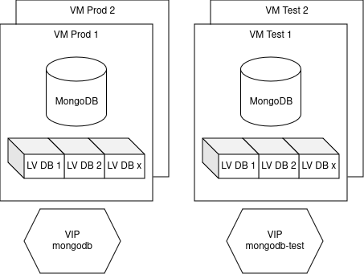

# MongoDB Ops

Ansible automation and other “ops” assets for the MongoDB hosting service.

## About

This repository contains the Ansible script to setup a MongoDB Community Edition
server on a RHEL virtual machine. It uses the [Ansible Suitcase], a portable
Ansible wrapped in a shell script called [mongosible](./mongosible). Among
others, it uses the [community.mongodb] collection.

## Prerequisites

In order to be able to run the [mongosible](./mongosible) script, access to
`/keybase/team/epfl_mongodb` directory is required. In addition, you need to be
within the EPFL network.

## Bird's view

## Usage

The Ansible role in this repository is meant to be used in very specific steps
in order to achieve the deployment of a fully functional service.

As in other [Ansible Suitcase] script, launching the defaults will only access
the test environment. Use `--prod` to start sweating.

### Setup the VM

The following tasks will install the prerequisites on the VMs:
  - `vm-access.yml` ensures that SSH keys from `access-vars.yml` are installed
  - `vm-os.yml` uses the [ansible.builtin.dnf] module to upgrade everything and
    install some convenient or needed packages such as `nmap`, `tmux`, `pip` or
    `restic`.
  - `vm-lvm.yml` setups the volume group, the logical volumes, formats them in XFS
    (as strongly recommended by MongoDB[^1]) and mounts them in the storage path.

These tasks can be ran with the `-t vm` tag.

### Install and manage MongoDB

This group of files manages the installation, the configuration and the setup of
the MongoDB application.

  - `mongo-install.yml` actually install a pinned version of MongoDB (defined as
    `mongodb_version` in the `mongo-vars.yml` file). Ensure that this version
    will not change with upgrade commands.
  - `mongo-setup.yml` configures and setups the MongoDB parameters by changing the
    `/etc/mongod.conf` file. It creates a user with a root role, enables the
    MongoDB authentification and changes the MongoDB storage path.
  - `mongo-manage.yml` creates the users for every databases.

These tasks can be ran with the `-t mongo` tag.

At this point, one would be able to connect to a specific database. Also see
[dev scripts](#dev-scripts) below.

### Managing backups

The following tasks are made to manage backups lifecycle.

  - `mongo-backup.yml` use `db.fsyncLock()`, `mongodump` and `db.fsyncUnlock()`
     to create a backup and save it on S3 with [restic]. Also install a crontab
     for local backups every 6 hours, and keep 1 backup per day for a week,
     and 1 backup per week for a month, and remove backups older than 1 year.
  - `mongo-restore.yml` will restore the latest backup.

Use the `-t mongo.backup`, `-t mongo.unlock`, `-t mongo.restore` tags to achieve
what's needed.

### Managing VIP

The “prod” and “test” environments each have 2 virtual machines and one
virtual IP (VIP) respectively associated with the [mongodb.epfl.ch] and
[mongodb-test.epfl.ch] domain names. This setup allows operators to handle
updates and other maintenance operations on the virtual machine that does
not have the VIP. When everything is ready (with the proper announcements),
operators can lock the currently active database, run the backup tasks, then
restore it on the inactive database and move the VIP. While this system has
some downtime, it's minimal and allows operators to test everything before the
switch.

In order to switch the VIP from A to B (or blue to green), use the `-t vm.vip`
tag. The `vm-vip-check.yml` task is imported whenever needed (such in the
backups tasks) and the `vm-vip.yml` task does the switch with the proper
`arping` commands to update neighbours' ARP caches.

### Tools

In addition to the others tasks, `tools.yml` provides some tools dedicated to the
operators work.

  - `tools.connect` will display the connection string to connect to one of the
    MongoDB database of the inventory.
  - `tools.restic` will display the restic `ls` command with the correct
    exported secrets.

### dev-scripts

This directory contains the `export-import.sh` shell script that an operator can
use for an initial import from a MongoDB database hosted elsewhere.

## Contributing

We <3 pull requests and [issues]. Feel free to open one to share something with
us.

## Contributors

See [contributors](https://github.com/epfl-si/mongodb.ops/graphs/contributors).

[Ansible Suitcase]: https://github.com/epfl-si/ansible.suitcase
[community.mongodb]: https://docs.ansible.com/ansible/latest/collections/community/mongodb/index.html
[ansible.builtin.dnf]: https://docs.ansible.com/ansible/latest/collections/ansible/builtin/dnf_module.html
[mongodb.epfl.ch]: https://mongodb.epfl.ch
[mongodb-test.epfl.ch]: https://mongodb-test.epfl.ch
[restic]: https://restic.net/
[issues]: https://github.com/epfl-si/mongodb.ops/issues
[^1]: https://www.mongodb.com/docs/manual/administration/production-notes/#kernel-and-file-systems
